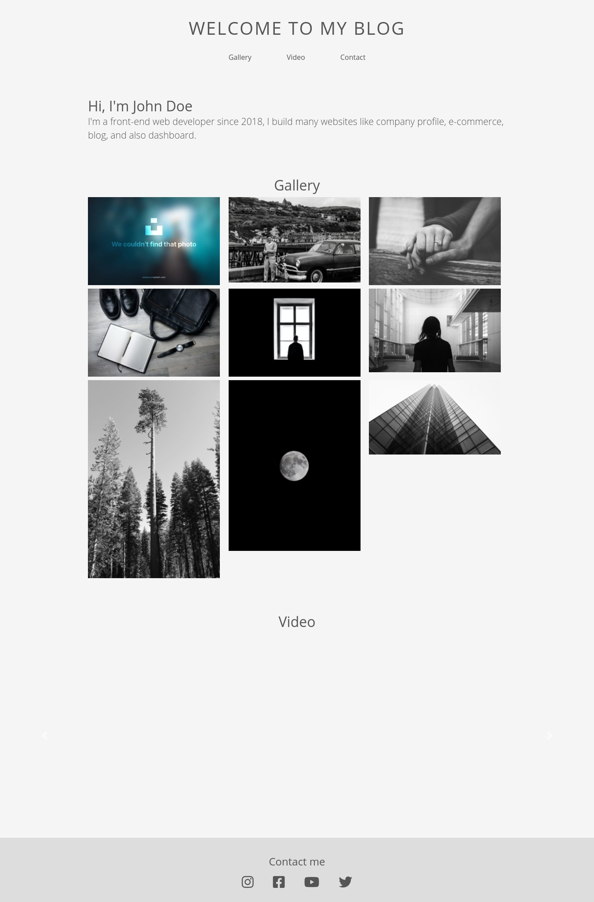

# Simple HTML Blog

This is my experiment to create a simple blog using HTML, CSS, Jquery. This blog was created to experiment with REST API. The photos would be replaced with photos from Instagram using API while the video is using the embedded YouTube videos. I was curious how could I integrate it all in one place so I created this simple blog just out of curiosity.

  

